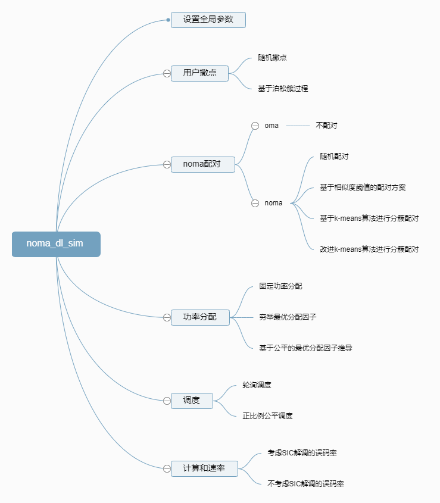
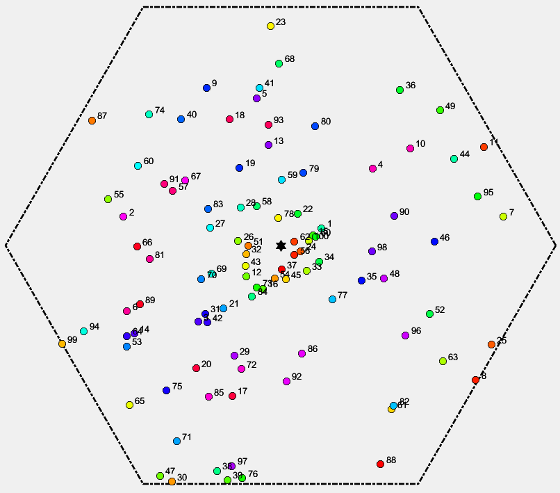
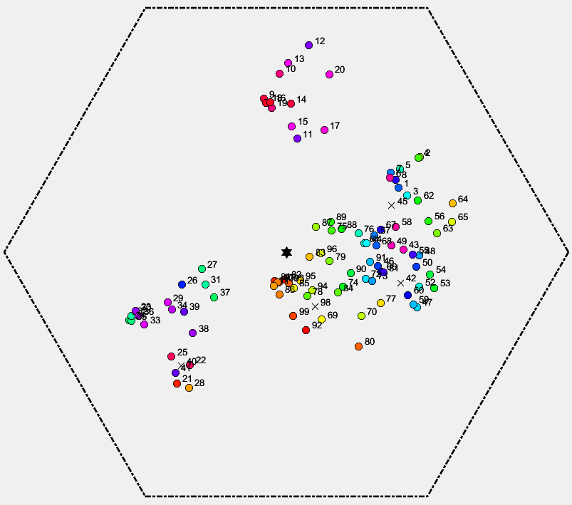

# noma_dl_sim 平台设计
## 一、平台总体框架

## 二、详细设计

### 2.1 撒点方案

#### 随机撒点
- 随机生成角度，计算最远可达距离
- 随机获得用户距离基站的距离，避免灯下黑
- 基于路损模型计算路损
- 基于信道模型计算信道

#### 基于泊松簇过程
- 根据用户数计算簇的密度并确定最终簇的个数
- 生成簇的中心坐标
- 根据簇的中心坐标随机确定周围用户的个数，确保用户数之和为参数设定值
- 在每个簇周围生成用户坐标，避免出界与灯下黑
- 基于路损模型计算路损
- 基于信道模型计算信道

### 2.2 NOMA 配对方案

#### 不配对
- 所有用户各自单独分成一个组
#### 随机配对
- 根据用户生成编号随机两两配对
#### 基于相似度阈值
- 计算所有用户信道相似度矩阵
- 计算所有用户信道增益矩阵
- 筛选相似度满足阈值要求的可能配对组合
- 将可能配对组合中信道增益差最大的组合依此提取
- 将剩下没有配对的用户各自单独分成一个组
#### K-means 算法分簇
- 随机选择 K 个用户作为 K 个簇的质心
- 计算每个用户到 K 个质心的相似度
- 划分用户到相似度最高的质心
- 重新计算每个簇的质心
- 重复直到每个簇的用户不再改变
- 根据每个簇的用户的路损信息两两配对
- 将未配对的用户各自单独分成一个组
#### 改进的 K-means 算法簇

### 2.3 功率分配方案

#### 固定功率分配因子
- 基于参数配置，对每组用户采用相同的功率分配因子 rho
#### 基于公平的最优分配因子
- 公平：所有 NOMA 用户的速率大于其在 OMA 情形下的速率
- 基于公平的基础上计算功率分配因子 rho
### 2.4 调度方案

#### 轮询调度
- 根据用户组的编号依次调度
#### 正比例公平调度
- 根据瞬时理想速率和历史平均速率计算用户组的优先级
- 根据用户组的优先级依次调度
### 2.5 计算和速率

#### 不考虑 SIC 解调的误码率
- 计算强用户消除弱用户信号干扰后，解调自己信号的信干噪比
- 计算弱用户在强用户信号干扰下，解调自己信号的信干噪比
- 根据香农公式计算和速率
#### 考虑 SIC 解调的误码率

## 三、画图分析

### 3.1 撒点配对图

### 3.2 NOMA vs. OMA

### 3.3 用户数持续增长分析

### 3.4 不同分簇配对方案分析

### 3.5 不同功率分配方案分析