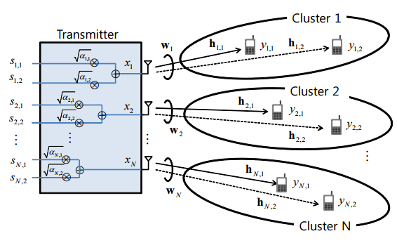

# noma_dl_sim
## 1. 介绍
- NOMA 通过对簇内用户分配不同的发射功率，能够在功率域实现不同用户信号的区分，通过采用串行干扰消除（Successive Interference Cancellation, SIC）技术对距离基站近、信道环境较好的用户信号进行恢复，从而实现空域，时域和频域的非正交数据传输，在不增加带宽消耗的条件下显著改善系统频谱线路和传输可靠性。
- MIMO 下行通信以空分多址技术（Space Division Multiple Access, SDMA）根据不同用户的空间特征差异，采用阵列天线技术对多个用户形城空间上可分离的方向波束，从而在同一频道上实现多路用户信号的无干扰传输。在传统多用户波束赋形（Beamforming, BF）系统中，每个用户被一个波束赋形向量服务，不同波束赋形向量之间彼此正交，因此可以消除其他用户的干扰。
- 由于无线信道的随机性， 当多个用户的空间特征较高时，SDMA 无法对他们进行有效的区分，此外，在 MIMO 下行通信系统中，由于基站能够同时发送的独立数据流个数不能超过其发射天线数，而系统中通常存在较多具有通信需求的用户，因此基站只能从众多用户中调度一部分与之通信。将 NOMA 技术与 MIMO 通信系统相结合，使基站对具有强空间相关的一对用户采用相同的预编码同时进行数据发送，并通过合理的功率分配使他们在功率域可以区分，从而在保证良好的系统和速率性能的同时增加系统可支持的并发用户数。
- 合理的用户分簇算法能够减小用户信号之间的相互干扰，提高系统和速率。簇内用户由于共享同一个波束赋形向量，应使簇内用户信道之间的空间特征差异要足够小，即信道特征要足够相似，否则将会引起很大的簇间干扰。另外，根据香农公式，同一块时频资源上速率：
```mathjax
$$C_{oma} = \log(1+\frac{S}{N})$$
```
其中，$S$ 和 $N$ 分别是信号功率和噪声功率。若该时频资源分给两个 NOMA 用户使用， $S$ 为两用户信号功率 $S_1$ 和 $S_2$ 的叠加，噪声功率分别为 $N_1$ 和 $N_2$, 则：
```mathjax
$$C_{noma} = \log(1+\frac{S_1}{N_1})+\log(1+\frac{S_2}{S_1+N_2})$$
```
当 $N_2$ 远大于 $N_1$ ，且 $S_2$ 几乎占了所有 $S$ ，则第二项 $\log(1+\frac{S_2}{S_1+N_2}) ≈ \log(1+\frac{S_2}{N_2})$ ，则在该时频资源上，第一项 $\log(1+\frac{S_1}{N_1})$ 就是 NOMA 技术带来的增益。由此，合理的用户分簇算法应在满足簇内用户信道足够相似的条件下，尽可能增大彼此的信道增益差，来降低簇间干扰和簇内干扰。
## 2. 系统模型
- 研究单小区 MIMO 下行系统，包含一个基站（Base Station, BS）和多个终端（Mobile Station, MS），小区半径为 $\phi$ ，单位为 m。BS 的发射功率为 $P_T$，BS 与 MS 分别配置 $N_T$ 和 $N_R$ 根天线，BS 采用波束赋形的方式给每个 MS 发送数据。受发射端天线数的限制，BS 能够同时发送的空域上可分离的数据流个数不超过 $N_T$ 。结合 NOMA 技术，引入功率域的用户区分，若簇内用户使用同一时频资源，那么系统能够支持的并发传输的数据流个数增加至 $aN_T$，$a$ 为每个簇包含的平均用户数。
- 如图所示，BS 配有 N 根发射天线，MS 配有单根接收天线。为了简洁起见，假设每个簇内用户数为2个，因此系统使用 N 个波束赋形向量可以同时支持最多 2N 个用户。簇内有较大（小）信道增益的用户成为强（弱）用户，在第 n 个簇，$y\_{n,1}$ 和 $y\_{n,2}$ 分别表示强用户和弱用户的接收信号：
```mathjax
$$y_{n,i} = h_{n,i}\sum^N_{k=1}w_kx_k+n_{n,i}, \ i\in\{1,2\} \ n\in\{1,2,...,N\}$$
```
其中 $x_k$ 包括第 k 个簇强用户和弱用户发送信号的叠加，譬如 $x_k = \sqrt{\alpha\_{k,1}}s\_{k,1}+\sqrt{\alpha\_{k,2}}s\_{k,2}$，$s\_{k,1}$ 和 $s\_{k,2}$ 分别是第 k 个簇强用户和弱用户发送信号，$\alpha\_{k,1}$ 和 $\alpha\_{k,2}$ 分别是第 k 个簇强用户和弱用户发送的功率分配因子，并且 $\alpha\_{k,1}+\alpha\_{k,2}=1$ 。$h\_{k,1}$ 和 $h\_{k,2}$ 分别是第 k 个簇强用户和弱用户的信道特征向量，$w_k$ 是与第 k 个簇关联的波束赋形向量，$n\_{n,1}$ 和 $n\_{n,2}$ 分别是两用户对应的加性高斯白噪声，均值为 0，方差为 $\sigma^2_n$。


- 信道建模：信道矩阵 h 是路径损耗与 0 均值、单位方差的瑞利衰落的乘积构成的矩阵，特别地，当接收天线数目为 1，发送天线数目为 N 时：
```mathjax
$$h = pathloss · [e^{sin(\theta)},e^{sin(\theta - \frac{2\pi}{N})},e^{sin(\theta - \frac{4\pi}{N})},...,e^{sin(\theta - \frac{2\pi}{N}i)},...,e^{sin(\theta - \frac{2\pi}{N}(N-1))}]^T$$
```
其中 $\theta$ 为接收天线与第一根发送天线的夹角，由用户在小区中的位置确定。
- 为了简洁起见，使用迫零算法（Zero-Forcing, ZF）生成波束赋形向量。由于BS 给同一个簇的用户发射的信号是相同的，因为同一个簇的用户共享一个波束赋形向量。这里每个簇的波束赋形向量由簇内强用户的信道特征 $h\_m$ 生成，满足：
```mathjax
$$\frac{h_m}{|h_m|}w_n=
\begin{cases}
0& \text{m≠n}\\
1& \text{m=n}
\end{cases}$$
```
因此，每个簇内的强用户没有簇间感染，而弱用户会受到其他其他簇发送信号的干扰。每个簇的强用户的信道特征向量组成 $H = [h\_{1,1}, h\_{2,1},..., h\_{N,1}]^T$ ,$h\_{k,1}$ 为 Nx1 大小的第 k 个簇的信道特征向量，则：
```mathjax
$$W=[w_1,w_2,...,w_N]=H^\dagger=H^*(HH^*)^{-1}$$
```
其中，$(.)\dagger$ 表示矩阵的伪逆，$w_k$ 表示第 k 个簇的波束赋形向量，大小为 Nx1。
- 计算强用户信干噪比：
## 3. 分簇算法
- 
## 4. 功率分配
- 